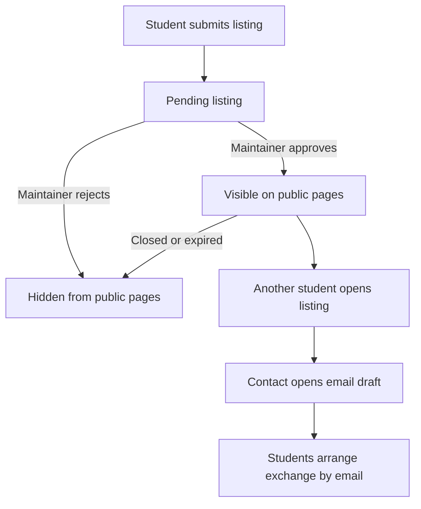

# Bearcat Skill Exchange — MVP System Blueprint

> Status: Working proposal. Scope and technical decisions may change
> as the team learns. Record significant changes and their reasons.
>
> Tracking: BSS-2 — Define MVP scope and document project decisions.

## 1. Product and first milestone

Bearcat Skill Exchange helps Northwest Missouri State University students
discover and exchange small skills.

Student A posts what they can help with and what help they would like
in return. Student B browses the listings and selects Contact, opening
their own email app to propose an exchange. They arrange the details
through ordinary email.

Example: “I can review a résumé for 20 minutes. I would like help taking
a headshot.” A student who takes photos contacts the poster and suggests
a time.

Contacting a poster does not mean an exchange was accepted or completed.
The MVP does not track agreements or completed exchanges.

### MVP completion criteria

- A student can submit a listing.
- A maintainer can approve, reject or close it.
- Another student can browse and filter visible listings.
- They can view a listing and open an email draft to its poster.
- Pending, rejected, closed and expired listings are hidden from public pages.

Gather feedback from five students before implementing the listing flow.
Use their examples to check whether plausible exchanges emerge.

The first demonstration uses test data and test email addresses.
A real student pilot requires an agreed review process and hosting owner.

## 2. Proposed stack

| Layer | Choice | Reason |
| --- | --- | --- |
| Application | Python + Django | Handles forms, pages, database access and review controls in one codebase. |
| Pages | Django templates + plain CSS | Keeps the initial interface simple without a separate frontend build. |
| Database | PostgreSQL | The team manages its database and schema through Django migrations. |
| Listing review | Django admin | Provides review controls for authorized maintainers. |
| Task tracking | Jira, project key BSS | Tracks scope, tasks, bugs and acceptance criteria. |
| Primary repository | Work GitLab | Hosts shared code, merge requests, reviews and CI. |
| Secondary repository | Personal GitHub | Stores a secondary copy and transfers committed work between computers. |
| Hosting | Decide with LTC after the local demo | Choose infrastructure the team can operate and maintain. |

The initial application does not use Supabase, Firebase, a hosted
authentication service or an email-sending service.

There is no student sign-in in the MVP. Maintainers sign in to Django admin.
Student accounts can be considered after the initial flow works.

Select a supported Django release during scaffolding and pin dependencies
in requirements.txt. Record the required Python and PostgreSQL versions
in the README.

## 3. User and system flow



Django receives submissions, validates their fields and stores them
in PostgreSQL. Django templates display public listings. Authorized
maintainers review records through Django admin.

Only approved listings with a future expiration time appear publicly.
Use the same visibility rule for browse and detail pages.

Successful submission shows “Received for review.” It does not publish
the listing immediately.

Entered names and email addresses are not verified. Even an address ending
in @nwmissouri.edu does not prove that the submitter owns it.

The form must explain that an approved listing exposes its contact email
to visitors, including through the page source.

## 4. Screens, routes and fields

| Page | Route | Behavior |
| --- | --- | --- |
| Browse | GET / | Show approved, unexpired listings, an optional skill filter and an empty state. |
| New listing | GET /post/ and POST /post/ | Display the form, validate input and save a pending listing. |
| Submission confirmation | GET /post/submitted/ | Show a generic confirmation after a successful submission. |
| Listing detail | GET /listings/<uuid:id>/ | Show a visible listing and its Contact button. Hidden or unknown listings return 404. |
| Review | /admin/ | Allow authorized maintainers to review and update listings. |

After a successful POST, redirect to the confirmation page so refreshing
the page does not repeat the submission.

### Submission fields

| Field | Requirement |
| --- | --- |
| Display name | Required; 2–60 characters. |
| Offered skill category | Required; one of the defined categories. |
| Specific offer | Required; 10–500 characters. |
| Wanted help | Required; 10–500 characters. |
| Availability | Optional; up to 200 characters. |
| Contact email | Required; valid email format, up to 254 characters. |
| Public email acknowledgment | Required; confirms that the email will be public if approved. |

Do not collect phone numbers, exact personal addresses or file uploads
in the MVP.

The Contact button opens an editable mailto draft addressed to the poster.
Use a subject such as “Bearcat Skill Exchange: Résumé review.”
Encode the subject correctly when constructing the link.

Contact does not send email automatically. The user needs a configured
email application or handler.

Validate required fields and lengths on the server. Keep Django's
template escaping enabled and use CSRF protection on the submission form.

Review controls require a maintainer account with appropriate permissions.
Public visitors cannot approve, reject or close listings.

## 5. Database schema

Django models and migrations are the source of truth for the schema.
Do not maintain a separate handwritten CREATE TABLE script.

### Listing model

| Field | Type | Rule |
| --- | --- | --- |
| id | UUID primary key | Generated on creation. |
| display_name | varchar(60) | Required. |
| offered_skill | varchar(32) | Design, Photography, Coding, Writing, Presentations or Other. |
| offer_description | varchar(500) | Required. |
| wanted_help | varchar(500) | Required. |
| availability | varchar(200) | Optional; defaults to an empty string. |
| contact_email | varchar(254) | Valid email format; ownership is not verified. |
| status | varchar(12) | Defaults to pending; approved, rejected or closed are set by maintainers. |
| created_at | Timestamp with timezone | Set on creation. |
| expires_at | Timestamp with timezone | Defaults to 14 days after creation. |

The public email acknowledgment is a required form checkbox.
It is not stored as a separate database field in the initial MVP.

Add an initial index on (status, offered_skill, created_at).
Revisit indexing if actual queries or data volume justify changes.

Centralize public visibility in a queryset or manager method:

```python
Listing.objects.filter(
    status="approved",
    expires_at__gt=timezone.now(),
)
```

Use this rule for both browse and detail queries.

Exclude status, created_at and expires_at from the public submission form.
Set them on the server. Submitted request fields must not override them.

Expiration hides a listing without deleting it. An expired listing may
still have an approved status in the database.

Use created_at descending for the initial browse order.

One application table is sufficient for this MVP. Django's built-in
authentication tables support maintainer accounts.

## 6. Repository layout

The target structure will be created incrementally.

```text
bearcat-skill-exchange/
    manage.py
    requirements.txt
    .gitignore
    .env.example
    README.md
    CONTRIBUTING.md
    config/
        settings.py
        urls.py
        asgi.py
        wsgi.py
    listings/
        models.py
        forms.py
        views.py
        urls.py
        admin.py
        tests.py
        migrations/
    templates/
        base.html
        listings/
            browse.html
            post.html
            detail.html
            submitted.html
    static/
        css/
            site.css
    docs/
        blueprint.md
        decisions/
```

Repository description:

“A campus skill exchange board where Northwest students offer small
skills, discover potential exchanges and connect by email.”

Keep credentials out of Git. Store actual database credentials and
Django secret keys in local environment configuration.
Commit .env.example with placeholder values only.

Document configuration loading and setup commands when the application
is scaffolded.

## 7. Roadmap

Work proceeds by milestones. The team will agree on estimates and dates
as each milestone is planned. There is no fixed 30-hour limit.

| Milestone | Work | Demonstrable result |
| --- | --- | --- |
| 1. Project foundation | Review scope, document workflow, gather student feedback and sketch pages. | Reviewed blueprint and clear acceptance criteria. |
| 2. Running application | Scaffold Django, connect PostgreSQL and implement the listing model. | Both developers can run the application locally. |
| 3. Submission and review | Implement the form, confirmation page and admin review controls. | A submission stays pending until approved. |
| 4. Discovery and contact | Implement browse, filtering, detail pages and email contact links. | Another student can find a listing and start an email. |
| 5. Demo readiness | Verify visibility, validation, mobile layout and the complete flow. | Repeatable demonstration with setup instructions. |

### Existing Jira tickets

| Ticket | Title |
| --- | --- |
| BSS-1 | Create and clone GitLab repository |
| BSS-2 | Define MVP scope and document project decisions |
| BSS-6 | Define student user flows and acceptance criteria |
| BSS-7 | Scaffold Django project and verify local startup |
| BSS-8 | Configure local PostgreSQL and Django connection |
| BSS-5 | Implement listing model and initial migration |
| BSS-3 | Build base page layout and navigation |
| BSS-4 | Implement listing submission and validation |

Create additional tickets for admin review, browse/filtering,
detail/contact, CI and demo verification as those milestones are planned.

Assign ownership per ticket. Both developers review each other's work
and coordinate before changing shared files.

## 8. Development workflow

Jira tracks the work. GitLab is the primary team repository and hosts
merge requests, reviews and CI. Personal GitHub is a secondary copy.

Use main plus short-lived task branches.

| Item | Example |
| --- | --- |
| Jira ticket | BSS-2 |
| Branch | docs/BSS-2-mvp-scope |
| Commit | docs: update working MVP blueprint (BSS-2) |
| Merge request | BSS-2: Define MVP scope and document project decisions |

Use feat, fix, docs, test, refactor or chore commit prefixes as appropriate.
Each commit should represent one understandable change.

Protect main from direct pushes and force pushes. Merge task branches
through GitLab merge requests after teammate review and relevant checks.

Each implementation ticket includes:
- Purpose and scope.
- Acceptance criteria.
- Verification steps.

A ticket is Done when its acceptance criteria pass, its merge request
is reviewed and merged, relevant checks pass and necessary documentation
is updated.

Use To Do → In Progress → In Review → Done on the Jira board.
Normally keep one main implementation task active per developer.

### Working across two computers

Each computer has its own local checkout and remote configuration.

Before changing computers:
1. Save files.
2. Commit the intended changes.
3. Push the task branch to a reachable remote.
4. Confirm the push succeeded.

Before editing on the next computer:
1. Check git status for local changes.
2. Fetch the remote containing the latest commits.
3. Switch to the task branch.
4. Pull that branch with --ff-only.

When GitLab is unavailable off campus, push the task branch to GitHub.
On campus, pull that branch from GitHub and push it to GitLab.

Before requesting review, fetch GitLab and incorporate any necessary
changes from origin/main into the task branch.

After a merge, update local main from GitLab and push main to GitHub.
The personal laptop can then pull the updated main from GitHub.

Do not force-push to resolve unexpected divergence. Inspect the histories
and resolve the cause first.

## 9. Verification

Verify these behaviors before the demonstration:

- Browse and detail pages show only approved, unexpired listings.
- Pending, rejected, closed and expired listings remain hidden,
  including through direct detail URLs.
- A valid submission creates a pending record.
- Extra request fields cannot set approval status or server-managed dates.
- Invalid and excessively long input produces useful validation errors.
- Authorized maintainers can review listings.
- Public visitors cannot perform review actions.
- Contact opens an editable draft addressed to the correct email.
- Contact does not send an email automatically.
- Refreshing the confirmation page does not create another listing.
- The complete submission → review → discovery → contact flow works
  on a phone-size screen and in two browsers.

Write focused automated tests for public visibility, submission validation
and server-controlled fields. Add other tests when they protect meaningful
behavior.

Perform a manual full-flow check before the demo.

##